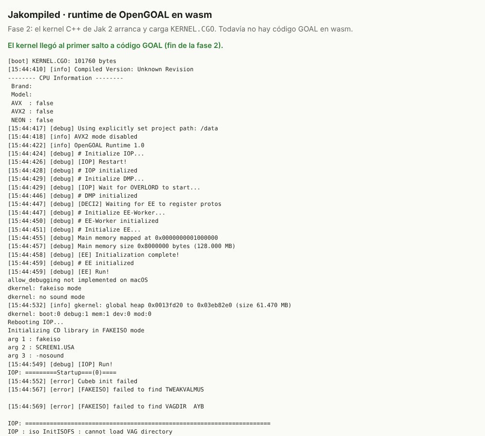

# Fase 2: el runtime de OpenGOAL en el navegador

> **Resultado: `gk`, el runtime C++ de OpenGOAL, compila con Emscripten y arranca en Chromium.** Inicializa el kernel de Jak 2, levanta el IOP y el overlord en hilos, carga `KERNEL.CGO` por RPC y enlaza el primer objeto (`gcommon`). Se detiene, como estaba previsto, en el primer salto a código GOAL. Ejecutar ese código es trabajo de la fase 3.

No hace falta la ISO: `KERNEL.CGO` lo genera `goalc` a partir de `goal_src/` y no contiene datos del juego.

## Lo que se ve en el navegador



Salida de [`web/test-boot.mjs`](../web/test-boot.mjs) en Chromium headless, recortada:

```
[test] crossOriginIsolated=true
[boot] KERNEL.CGO: 101760 bytes
[info] OpenGOAL Runtime 1.0
dkernel: fakeiso mode
[info] gkernel: global heap 0x0013fd20 to 0x03eb82e0 (size 61.470 MB)
Rebooting IOP...
Initializing CD library in FAKEISO mode
IOP: =========Startup===(0)====
IOP: =========After inits=============
InitIOP OK
kernel: RPC port #0 started [FAB0]   …   kernel: RPC port #5 started [FAB5]
[debug] [Load and Link DGO From C] kernel
[debug] [Begin Loading DGO RPC] KERNEL.CGO, 0x36b82c0, 0x3ab82c0, 0x172580
[debug] [link and exec] gcommon            0  22151 heap-use   206922  3145728: 0x17256a
[debug] link finish: gcommon
[jakompiled] call_goal_on_stack: call into GOAL code at GOAL address 0x36b7be4 (wasm 0x46b7be4).
             GOAL code cannot run yet (goalc has no wasm backend); stopping.
[test] outcome=stopped reached_goal_call=true
```

Los heaps de GOAL caen en las mismas direcciones que en el runtime nativo (`0x13fd20`–`0x3eb82e0`). La parte que no es GOAL se comporta igual: EE, IOP, overlord, DGO por RPC y el enlazador `klink`.

Los errores de `TWEAKVALMUS`, `VAGDIR` y `Cubeb` también salen en nativo cuando no hay datos de la ISO ni dispositivo de audio. El de DECI2 se explica más abajo.

## Arquitectura

```
página (hilo principal)                   workers (pthreads de Emscripten)
───────────────────────                   ──────────────────────────────────────
index.html + boot.js                      main() de gk        (PROXY_TO_PTHREAD)
 · descarga data/KERNEL.CGO                ├─ hilo EE   → kernel C, klink, call_goal ⇒ stub
 · lo escribe en MEMFS                     ├─ hilo IOP  → kernel IOP
 · arranca gk.js                           │   └─ hilos IOP (libco → un pthread cada uno)
                                           │       overlord: ISO, DGO, RPC, sonido
                                           ├─ hilo EE-Worker
                                           └─ hilo DMP (DECI2: sin sockets, falla y sigue)
```

### Decisiones

**1. Memoria EE en una dirección fija de la memoria lineal.** Los 128 MB de RAM de la PS2 están en `[16 MB, 144 MB)` de la memoria wasm, y el resto del programa empieza en `-sGLOBAL_BASE=144MB`. Al arrancar se comprueba que no se solapan.

Así, un puntero GOAL se convierte en dirección wasm sumando una constante, y en la fase 3 esa constante cabe en el campo `offset` inmediato de cada `load`/`store`, sin coste. Esto ajusta el modelo de la fase 1, que suponía puntero GOAL = dirección wasm. En nativo se usaba `mmap` en una dirección fija, que en wasm no existe.

| Rango de la memoria wasm | Contenido |
|---|---|
| `0` – `16 MB` | Sin usar |
| `16 MB` – `144 MB` | Memoria principal del EE (memoria GOAL) |
| `144 MB` – … | Datos estáticos, pila y heap de `gk` |

**2. libco sobre pthreads.** libco cambia de pila con ensamblador, algo que wasm no permite. [`libco_pthread.cpp`](../patches/jak-project/0003-web-Emscripten-build-of-gk.patch) da a cada corrutina un pthread real y hace que `co_switch` pase el testigo al destino y bloquee a quien llama. Así nunca corre más de una a la vez y se conserva la semántica cooperativa de la que depende el kernel IOP. Antes de dormir en el futex hay una espera activa breve.

| `co_switch` ida y vuelta | Coste |
|---|---:|
| libco nativo (ensamblador) | ~10 ns |
| pthreads, nativo, solo futex | ~29 µs |
| pthreads, nativo, con espera activa | 0,5–0,9 µs |
| **pthreads, wasm (Node/V8), con espera activa** | **1,4–1,9 µs** |

Es un riesgo a vigilar: con unos 1.000 cambios por frame serían ~1,5–2 ms de los 16,6 ms disponibles. Habrá que medir cuántos hace el IOP con el juego en marcha (fase 4). Si son demasiados, la alternativa son las fibras de Emscripten (Asyncify limitado al código del IOP).

**3. `-D__linux__`.** OpenGOAL elige el código de cada plataforma con `#ifdef __linux__ / _WIN32 / __APPLE__`. La libc de Emscripten es musl, así que las rutas de Linux son las correctas. Sin esta definición fallaban 184 ficheros; con ella, 3. Lo que sí es exclusivo de Linux se parchea con `__EMSCRIPTEN__`: ptrace, `pthread_setname_np` e instrucciones CRC.

**4. `main()` en un worker (`-sPROXY_TO_PTHREAD`).** El runtime bloquea hilos constantemente y el hilo principal del navegador no puede bloquearse. Consecuencia para la fase 4: el renderer tendrá que usar `OffscreenCanvas` desde el worker o enviar el trabajo al hilo principal.

**5. Dependencias sustituidas.**

| Dependencia | Sustitución |
|---|---|
| Trampolines x86 (`asm_funcs_x86_64.asm`) | `asm_funcs_web.cpp`: registran el salto a GOAL y paran (hasta la fase 3) |
| cubeb (audio) | Stub que falla `cubeb_init`; el reproductor sigue en silencio, como en nativo sin audio (fase 5: Web Audio) |
| libcurl | Stub: las peticiones fallan (solo se usa para tiempos de speedrun) |
| discord-rpc | Stub vacío |
| xdbg (depurador con ptrace) | La rama de stubs que ya existía para macOS |
| CRC32C por SSE4.2 | Versión por tabla, verificada contra `_mm_crc32` (0 discrepancias en 2.000 entradas) |
| Descompresión draco en tiny_gltf | Desactivada (no se usa en el runtime) |

**6. Datos.** Por ahora `boot.js` descarga `KERNEL.CGO` y lo escribe en el sistema de ficheros en memoria (MEMFS). Con datos de la ISO esto pasará a OPFS (fases 4 y 5).

**7. Cabeceras COOP/COEP.** `SharedArrayBuffer`, necesario para los pthreads, exige aislamiento cross-origin. [`web/serve.mjs`](../web/serve.mjs) es un servidor estático mínimo que las añade.

### Un bug real encontrado por wasm

Los hilos del IOP se declaraban como `u32 (*)()` y el kernel los guardaba y llamaba como `void (*)()`. Llamar a una función a través de un tipo distinto es comportamiento indefinido en C++. En x86 y ARM funciona por casualidad, pero wasm comprueba la firma en cada llamada indirecta y aborta (`function signature mismatch`).

El parche [`0001`](../patches/jak-project/0001-IOP-kernel-keep-the-real-signature-of-thread-entry-p.patch) guarda el tipo real. Es independiente del resto y se puede proponer a upstream tal cual. También `fmt/format.h` usaba `malloc`/`free` sin incluir `<cstdlib>` y funcionaba gracias a un include transitivo de libstdc++.

## Parches sobre jak-project

Los cambios viven en [`patches/jak-project/`](../patches/jak-project/), sobre el commit `efb21c3`:

| Parche | Contenido |
|---|---|
| `0001` | IOP: firma real de las funciones de hilo (corrección de UB, aplicable upstream) |
| `0002` | Soporte de plataforma Emscripten: memoria EE fija, CRC32C por software, sin ptrace ni AVX, `printf` de `u64` |
| `0003` | `web/CMakeLists.txt`, libco sobre pthreads, stubs, trampolines y ajustes de CMake |

El código existente apenas cambia: 13 ficheros y unas 90 líneas. El resto son ficheros nuevos bajo `web/`.

## Medidas

| | |
|---|---|
| `gk.wasm` | 10,2 MB (2,8 MB con gzip). Incluye nombres de función y aserciones; los cuatro juegos van en el mismo binario |
| `gk.js` | 0,3 MB |
| Desde `main()` hasta el salto a `gcommon` | ~100 ms |
| Emscripten | 6.0.11 |

## Reproducir

```sh
source <emsdk>/emsdk_env.sh
web/build_runtime.sh            # clona jak-project, aplica parches, compila gk (wasm) y goalc (nativo)
node web/serve.mjs web/dist 8080
# abrir http://localhost:8080/  o, sin navegador:
PLAYWRIGHT=$(npm root -g)/playwright/index.js node web/test-boot.mjs http://localhost:8080/
```

## Pendiente para fases posteriores

- **Fase 3:** sustituir los stubs de `asm_funcs_web.cpp` por llamadas reales a los módulos wasm de GOAL.
- **Fase 4:** renderer. `main()` corre en un worker, así que hará falta `OffscreenCanvas` o enviar el trabajo de GL al hilo principal. Medir allí los `co_switch` del IOP por frame.
- **DECI2/listener:** no hay sockets TCP en el navegador. Si se quiere usar el REPL de `goalc` contra el navegador, un puente WebSocket permitiría depurar.
- Emscripten avisa de que `-pthread` con `ALLOW_MEMORY_GROWTH` ralentiza el JS que accede a la memoria. Cuando se conozca el consumo real, conviene fijar un tamaño de memoria.
- Quitar `--profiling-funcs` y `ASSERTIONS` en una build de release.
